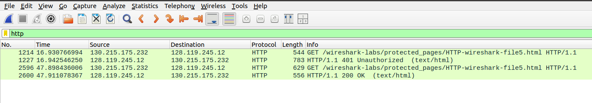

# **Lab 2 Report**
### Matthew Papesh - Feb 9th, 2025
### CS 3516

## Part 1 The Basic HTTP GET/response interaction:

Once Wireshark is running and filtering for http requests to then record the access and retrieval of http://gaia.cs.umass.edu/wireshark-labs/HTTP-wireshark-file1.html content, the following questions can be answered:

### **1 - Is your browser running HTTP version 1.0, 1.1, or 2? What version of HTTP is the server running?**
    The browser appears to be running HTTP version 1.1 on the browser and version 1.1 also on the server. 

### **2 - What languages (if any) does your browser indicate that it can accept to the server?**
    The browser appears to support American English and standard English as accepted languages. 

### **3 - What is the IP address of your computer? What is the IP address of the gaia.cs.umass.edu server**
    The IP address of my computer appears to be `130.215.175.232` accessing on port `57380` while the address of the server is `128.119.245.12`.

### **4 - What is the status code returned from the server to your browser?**
    The server HTTP returns a status code to the browser of `200 OK`.

### **5 - When was the HTML file that you are retrieving last modified at the server?**
    The file was last modified by the server on Sun, 9 Feb 2025 at time 06:59:02 GMT

### **6 - How many bytes of content are being returned to your browser?**
    `128` bytes of content was returned to the browser in a message that was `552` bytes long. 

### **7 - By inspecting the raw data in the packet content window, do you see any headers within the data that are not displayed in the packet-listing window? If so, name one.**
    The server info header is not visibly displayed in the packet-listing window but can be viewed by closer inspection to show the type of software run on the sever along with hardware info. 

## Part 2 The HTTP CONDITIONAL GET/response interaction:

### **8 - Inspect the contents of the first HTTP GET request from your browser to the server. Do you see an “IF-MODIFIED-SINCE” line in the HTTP GET?**
    IF-MODIFIED-SINCE is not found in the HTTP GET request. 

### **9 - Inspect the contents of the server response. Did the server explicitly return the contents of the file? How can you tell?**
    The server did return the contents of the file in a header called *line-based text data* that shows the HTML contents in code form.

### **10 - Now inspect the contents of the second HTTP GET request from your browser to the server. Do you see an “IF-MODIFIED-SINCE:” line in the HTTP GET 6 ? If so, what information follows the “IF-MODIFIED-SINCE:” header?**
    IF-MODIFIED-SINCE header does exist in the return from the server providing information on the date and time the contents on the browser side have been modified. Since the HTML is only modified once as caching prevents new retrievals of contents, subsequent HTTP requests will have this same header with the same date and time. 

### **11 - What is the HTTP status code and phrase returned from the server in response to this second HTTP GET? Did the server explicitly return the contents of the file? Explain.**
    The server returns a status code of `304 Not Modified` on the second HTTP GET. Given there is no *line-based text data* header and the data was not modified, it is understood that the server did not return any contents. This makes since given the fact that the first HTTP GET returned the HTTP contents that were then locally cached on the browser and used when refreshing the screen or in subsequent HTTP GET calls. This can be undone by clear the browser cache. 

## Part 3 Retrieving Long Documents:

### **12 - How many HTTP GET request messages did your browser send? Which packet number in the trace contains the GET message for the Bill or Rights?**
    - Only one HTTP GET request message was sent by the browser. 
    - Packet number `932`

### **13 - Which packet number in the trace contains the status code and phrase associated with the response to the HTTP GET request?**
    - Packet number `941`

### **14 - What is the status code and phrase in the response?**
    The status code and phrase was reported as `4927 HTTP`.

### **15 - How many data-containing TCP segments were needed to carry the single HTTP response and the text of the Bill of Rights?**
    Five TCP segments were needed to carry the single HTTP response. 

## Part 4 HTML Documents with Embedded Objects:

### **16 - How many HTTP GET request messages did your browser send? To which Internet addresses were these GET requests sent?**
    - The browser sent three HTTP GET request messages of (1) request the initial HTML content, (2) request /pearson.png and (3) request /8E_cover_small.jpg
    - The mentioned HTTP GET requests were sent to the following addresses respectively: (1) `128.119.245.12`, (2) `128.119.245.12`, and (3) `178.79.137.164`

### **17 - Can you tell whether your browser downloaded the two images serially, or whether they were downloaded from the two web sites in parallel? Explain.**
    The images were downloaded upon retrieval HTTP receipts from the server(s) where the person image completed downloading at 05:07:49 [hour:min:sec], but the cover image completed downloading at 05:07:50; approximately a second after the pearson image. Furthermore, the HTTP GET that initiated downloading the cover image was received by the server at 05:07:49.9763 where pearson was downloaded at 05:07:49.965. **Therefore, the cover image started to download about 10 milliseconds after the completion of downloading the pearson image.** This means that the images must have been downloaded serially. 

## Part 5 HTTP Authentication:

## **18 - What is the server’s response (status code and phrase) in response to the initial HTTP GET message from your browser?**
    The response is `544 GET`. 

## **19 - When your browser’s sends the HTTP GET message for the second time, what new field is included in the HTTP GET message?**
    The Authorization header / field is included in the HTTP GET message.

Image for questions: 18 and 19
