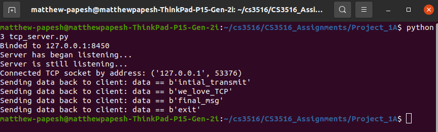

# **Project 1A Report**

### Matthew Papesh - Feb 3rd, 2025

### CS 3516

## Overview:    

The objective of this assignment was to explore and implement TCP and UDP protocols in python for communication between a given client and server. 

Transmission Protocol Standard [TCP] allows for the communication of data packets across a sending and receiving device given specified host names for targets at specified port entry points on known internet networks. TCP also is a reliable means of communicating as it transmits from a client device to a server such that the server will communicate back to the client that it as received its message. This is also good for error correction as lost or corrupted data packets can be communicated back to client and re-transmitted. 

User Datagram Protocol [UDP] allows for the communication of data packets across a sending and receiving device given specified receiving server host name and network entry point port on the sending client side. UDP is received by a server expecting or checking for transmissions from a given client given a pre-determined and known client host and network entry point port. However, the server only connects to the client temporarily and only upon receiving any potential transmitted data packets before disconnecting. UDP does not transmit from the server back to the client to insure the reliability of data packets. Unlike TCP that does this re-transmission, UDP does not. However, UDP may be faster with a smaller latency overhead as a result. 

TCP and UDP are used for different purposes. TCP is ideal for when data reliability is a must, and UDP is emphasized for when minimal latency is demanded. Examples of this is that TCP is good for sending emails or downloading websites when exploring the internet by http protocols. Where data accuracy is required. Meanwhile video calls and other live forms of communication can come in the form of UDP since staying live and not slowing down is needed; and if the video slightly glitches once in a one hour call from some erroneous data packets transmitted, then that is fine. 

## TCP Implementation:

TCP was implemented in python by use of the socket library on local host with a network entry point port of 8450. Sockets also transmit an expected buffer size of 1024 bits. A socket is opened client-side and server-side files (**tcp_client.py, tcp_server.py**) by calling `socket.socket()` where `socket.AF_INET` is used for indicating allowable internet protocols for communication while `socket.SOCK_STREAM` is specified for indicating the use of a TCP protocol. 

```py
# server-side TCP - opening communication 
# open communication via tcp
with s.socket(s.AF_INET, s.SOCK_STREAM) as tcp_socket:
	# enter specified entry point port and listen
	try:
		tcp_socket.bind((host, port))
		print("Binded to " + str(host) + ":" + str(port))
	except Exception as e:
		print(f"Error binding to socket: {e}")
	print("Server has began listening...")
	tcp_socket.listen()
	print("Server is still listening...")
	# confirm connection
	connection, address = tcp_socket.accept()
```

The socket on client-side first connects to a given server host and port. The client then spins collecting user input from the terminal that is then encoded to be sent to the server over TCP by use of the `sendall()` method. The client then receives data back from the server and is printed on the client. If the user input ever is `exit`, the client terminates. 

```py
# open communication via tcp
with s.socket(s.AF_INET, s.SOCK_STREAM) as tcp_socket:
	# connect to specified entry point port on server network
	tcp_socket.connect((host, port))
	while True:
		# transmit data from input
		msg = input("transmitting msg: ")
		tcp_socket.sendall(msg.encode()) # encode data
		# end client if told to exit
		if msg == "exit":
			print("exiting; ending service...")
			break
		# retrieve returned message from tcp 10240bit buffer size
		data = tcp_socket.recv(1024)
```

The socket on the server-side binds to the specified client host and entry port. The server begins to listen for transmissions from the client before accepting connection and client address. The server opens the connection, receives data by use of the `recv()` method and then prints the transmitted data. The server then sends the data back to the client. If a transmission is received without data, the server assumes the client as terminated and it to also exits and terminates. 

```py
# confirm connection
connection, address = tcp_socket.accept()
# open connection and listen/receive data by tcp
with connection:
	print("Connected TCP socket by address: " + str(address))
	while True:
		# listen for tcp data of 1024-bit buffer size
		data = connection.recv(1024)
		# contribute hosting server-side tcp as long as
		# client is still using service (not data == False)
		if not data:
			break
		# return data to client
		print("Sending data back to client: data == " + str(data))
		connection.sendall(data)
    # print data
	print("Received data: " + str(data))
```

## UDP Implementation:

UDP was implemented in python by use of the socket library on local host with a network entry point port of 8451. Sockets also transmit an expected buffer size of 1024 bits. A socket is opened client-side and server-side files (**udp_client.py, udp_server.py**) by calling `socket.socket()` where `socket.AF_INET` is used for indicating allowable internet protocols for communication while `socket.SOCK_DGRAM` is specified for indicating the use of UDP protocol.

```py
# server-side UDP - opening communication 
with s.socket(s.AF_INET, s.SOCK_DGRAM) as udp_socket:
	# enter specified entry point port and bind
    try:
	    udp_socket.bind((host, port))
    	print("Bounded to " + str(host) + ":" + str(port))
    except Exception as e:
	    print(f"Error binding to socket: {e}") 
```

The socket on the client-side does not initially connect to the server, but instead begins spinning instead to await user input. User input is encoded and then send over the socket by also specifying the server host and port at this time only. Data is then sent over to the server by UDP by use of the `sendto()` method, where not only is the data required, but so is the destination. If the user input ever is `exit`, the client terminates. 

```py
# open communication via udp
with s.socket(s.AF_INET, s.SOCK_DGRAM) as udp_socket:
	while True:
		# input data from user
		msg = input("transmitting msg: ")
		# end client if told to exit
		if msg == "exit":
			print("exiting; ending service...")
			break
		# temporarily connect for single transmission by udp
		udp_socket.sendto(msg.encode(), (host, port))
```

The socket on the server-side binds to the specified client host and entry port. The server begins by immediately spinning and awaits data packets sent from the expected client. The server does not connect to the client until when checking for received data by use of the `recvfrom()` method, where not only is the data returned, but so is the client address to identify the sender. The server then prints the retrieved data but does not transmit back to the client. The client assumes or does not know if the server has received its transmissions. 

```py
# open connection by udp
while True:
	# retrieve any received data from various clients by address
	data, address = udp_socket.recvfrom(1024)
	print("Received from client " + str(address) + ": " + str(data))
```

## Conclusion:

TCP and UDP are similar and yet different in many ways. TCP may be more reliable over UDP for data transmission, but UDP may have less latency and overhead over TCP. It is worth noticing how connections need to be bounded on both protocols, but TPC client connects as initialization to communication while UDP client only connects upon sending transmissions. TCP servers listen and accept connections to clients as initialization to receiving communication while UDP servers may not always initially know where transmissions come from. Moreover, it makes sense how TCP servers only return the data when receiving transmissions, but UDP servers also return the address of origin of the transmission. 



Overall, the implementations were similar, but were both designed with different uses in mind. The code was also designed with print statements and exception handling for debugging purposes. 