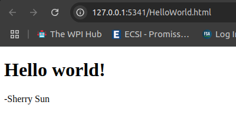
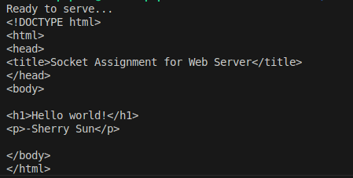
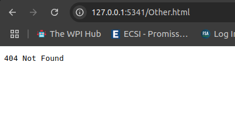

# Project 1B Report 
### Matthew Papesh - Feb 6th, 2025
### CS 3516

## Overview: 
The objective of this assignment was to explore and implement a web server providing html content. Hypertext Transfer Protocol [HTTP] is the the network protocol that enables web browser clients of users to exchange data on the World Wide Web. For specific purposes of project, the server will provide a html file on a local host for accessing by web browser with appropriate web error handling. 

## Web Server Implementation
The server was implemented in python by use of the socket library on local host with a network entry point port of `5341`. This was done by first opening a TCP socket at this local host port.  

```py
serverSocket = socket(AF_INET, SOCK_STREAM) # tcp connection

# prepare a server socket
# define host name and network entry port:
host = "127.0.0.1"
port = 5341
# establish the connection
print ('Ready to serve...')
serverSocket.bind((host, port))
serverSocket.listen()
```

This can be seen above as a TCP connection is indicated at the local host port specified by binding to that location and listening. This is what is necessary to first establish a web connection for the server. Once completed, the server is running and ready to idle and spin until it receives http requests over TCP from client users. 

Once the server is established, it begins to spin and wait for client requests that become accepted as they are seen. This is done by use of the `accept()` method that returns a socket for the confirmed connection between the client and the server along with the address of the requesting client. 

```py
# confirm connection
connectionSocket, addr = serverSocket.accept()
```

With communication ready, a message can be received by the server from the client with an expected transmission of a '1024'-bit buffer size. After decoding the message, if there is one available, it is parsed for the file name of the html being requested. It is assumed the client is transmitting http requests for html content when interacting with the server. If the file name is parsed and is successfully found local to the server directory and it shares the same root directory, the file can be opened to read content for sending back. This is done by transmitting a TCP response from server back to the client that consists of the encoded html content read from the requested file that follows after a html response header indicating successful retrieval of html. At this point, after sending the html to the client the socket can be closed. However, this functionality is under the pretense that the html file is found by the server, and so exception handling is necessary for attempting to run this html service while handling the case the html is not found when opening the file. 

```py
try:
    # receive 1024-bit buffer msg
    message = connectionSocket.recv(1024).decode()
    if message: # only read if a msg was sent
        filename = message.split()[1]
        f = open(filename[1:])
        outputdata = f.read()
        print(outputdata)
        # send one HTTP header line into socket
        responseHeader = "HTTP/1.1 200 OK\r\nContent-Type: text/html\r\n\r\n"
        response = responseHeader.encode() + outputdata.encode()
        connectionSocket.sendall(response)

    # send the content of the requested file to the client
    #for i in range(0, len(outputdata)):
    #    connectionSocket.send(outputdata[i].encode())
    connectionSocket.close()
```

Following the try-block is the exception handling for this exact concern. Should the requested html file fail to be found by the server, the only content transmitted back to the client is a *404 Not Found* error. This is done by failing to open local root directory files relative to the server that throws the exception. From which there's not content to send back and so an error is sent back instead before closing the socket.  

```py
except IOError:
        # send response message for file not found
        responseHeader = "HTTP/1.1 404 Not Found\r\n\r\n404 Not Found"
        connectionSocket.sendall(responseHeader.encode())
        # close client socket
        connectionSocket.close()
```

This functionality loops indefinitely until the server is shut down. Only TCP sockets to clients are ever closed so that the server can remain established to receive further http requests. However, in proper programming standards, the server is still told to close should it ever break out of its running loop. 

```py
# shut down the server 
serverSocket.close()
```

## Conclusion - How To Use:

First and foremost, the server needs to establish connection and begin running by running the python script: `python3 server.py` The host of the server will be prompted with the message of `Ready to serve...` from which the server is ready to receive http requests from client users. 


Recalling the server is running on the local host `127.0.0.1` with port `5341`, the server can be interacted with by a client browser such as Google Chrome. The URL of `http://127.0.0.0:5341` should then be hosting the service for html content retrieval. This can be done simply by treating the url as a local directory from which you specify the file after the location such as `http://127.0.0.1:5341/<file.html>`. 

This means that given `HelloWorld.html` is an accessible file on the server, it can be accessed while the server is running by visiting the URL `http://127.0.0.1:5341/HelloWorld.html`. In doing so successfully, the client user will be greeted by the website html with a title of *"Hello world!"*. Should another file be specified or this html incorrectly specified in the URL - maybe an accidental typo when typing the URL - the html will not be found as there is no other html files the server can access by any other name. This will leave the client user with a view of a *404 Not Found* error indicating the website was not found.  

<div class="row" style="display: flex; flex-direction: row; justify-content: center; align-items: center;">
    <div class="column" style="margin-right: 0%;">
        
    </div>
    <div class="column" style="margin-right: 5%;">
        
    </div>
    <div class="column" style="margin-left: 5%;">
        
    </div>
</div>

To conclude, this can be seen in the above demonstration where when the server is running and the correct html is specified, the server successfully retrieves the html the client views and outputs the html code from the active server terminal [left-side images]. Alternatively, if an incorrect html is specified, such as `other.html`, then the server fails to find html content and returns a *404 Not Found* error [right-side images]. 
