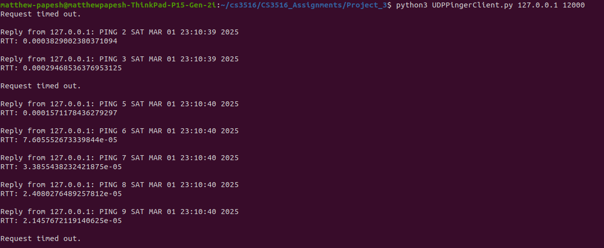

# Project 3 Report 
### Matthew Papesh - Mar 1st, 2025
### CS 3516

## Overview: 
The objective of this assignment was to explore and implement a client to ping a server while simulating packet loss. This is done by anticipating some packets sent to the server from the client will not be returned when the client pings the server. Pinging is used to send a message from the client and have it echoed or repeated by the server transmitting it back. All communication is done by UDP. Packet loss is demonstrated to represent how UDP can be unreliable as it is never ensured that data being transmitted is always getting received. 

## How To Use:
The program is used by first setting up the server. The server is established by running `UDPPingerServer.py` with no arguments in one terminal. Meanwhile, after the server is put online, `UDPPingerClient.py` can be run by specifying arguments for the server IP address and port for establishing a UDP socket connection. It is worth mentioning that the server is established on local host with port *12000* such that the arguments given the client program upon running are: `127.0.0.1 12000`. As a result, the programs can be run by the following:
```bash
# opened server terminal here
python3 UDPPingerServer.py 
# end of server terminal

# open another detached client terminal here
python3 UDPPingerClient.py 127.0.0.1 12000
# end of client terminal
```

**It is important to note the server needs to be established and spinning ensuring the server program is already running when going to run the client program**.

When interpreting program results, the client program will attempt to echo - transmit and then receive - date and time of the action to the server and wait for 1 second for a response from the server. Should a response be received, the client will print the ping and the received reply contents from the server, that should be the same as the initial transmission, and also print the round-trip time [RTT] in seconds. If a response is not received within a second, the client assumes the data packet was somehow lost in the network and the ping times out while printing out that an exception was thrown from timing out. The client will attempt to send and receive 10 pinged messages of time stamps and print the results of each ping in sequential order with printed indices. 

## Demonstrating the Program & Conclusion:  
When going to run the server followed by the client in the way specified, ten ping message results can be seen from the client terminal. As seen below: 


It can be noticed in the posted client results how client times out three times; once on the first ping, again on 4th ping, and once more on the 10th ping. This is to be somewhat expected as it is known that the server drops or loses 30% of its received transmissions for simulating UDP data packet loss. So for ten total pings, having three to come up lost or potentially causing the client to time out would be an anticipated outcome. Meanwhile for the other pings that appear successful, ping elapsed time [RTT] on average came up as approximately under 1 millisecond. 